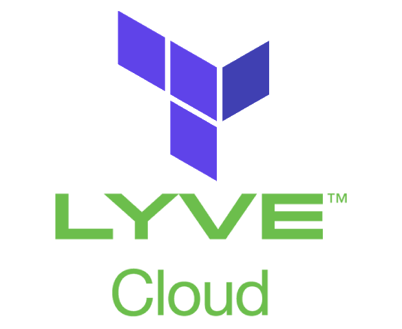

## Terraform Provider for Lyve Cloud
<p align="center">
  <a href="https://github.com/Seagate/terraform-provider-lyvecloud">
    
  </a>
  <p align="center">

A [Terraform](https://www.terraform.io) provider to manage [Lyve Cloud Storage](https://www.seagate.com/gb/en/services/cloud/storage/). \
This project is based on code samples from the official [AWS provider](https://github.com/hashicorp/terraform-provider-aws).

## Requirements

* [`Go 1.19`](https://go.dev/doc/install).
* [`Terraform v1.2`](https://www.terraform.io/downloads).

## Building and Installing
For development purposes, the provider needs to be build locally.

Clone this repository, and [install Task](https://taskfile.dev/installation/):
```sh
go install github.com/go-task/task/v3/cmd/task@latest
```
**Note:** for more installation options of [Task](https://taskfile.dev/), please view Task [installation guide](https://taskfile.dev/installation/).

Run the following command to build and install the plugin in the correct folder (resolved automatically based on the OS):
```sh
task install
```

## Usage

### Configure
To quickly get started using the provider, configure the provider as shown below.

```hcl
terraform {
  required_providers {
    lyvecloud = {
      version = "0.1.0"
      source  = "registry.terraform.io/seagate/lyvecloud"
    }
  }
}

provider "lyvecloud" {
  //s3 api - optional
  region = ""
  access_key = ""
  secret_key = ""
  endpoint_url = ""

  //acount api  - optional
  client_id = ""
  client_secret = ""
}
```


### Create bucket example

```hcl
resource "lyvecloud_s3_bucket" "example" {
  bucket = "my-tf-bucket"
}
```

For full provider documentation with details on all options available, see [docs](./docs/) folder.

## Tested By
* Sep 12, 2022: Alexander Chernin (alexander.chernin@seagate.com) on Windows 10.